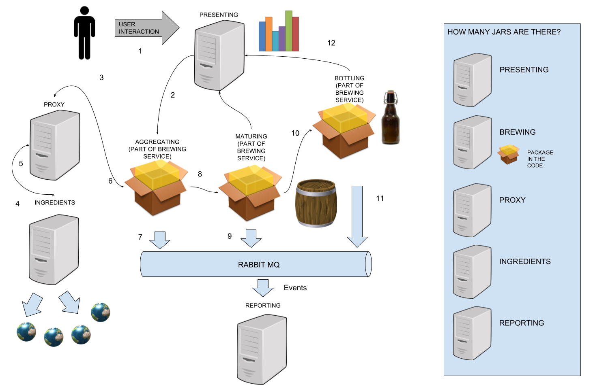

[](https://travis-ci.org/spring-cloud-samples/brewery)

# Brewery

Ever wanted to brew your beer using microservices? This repository will allow you to do so!

This repository is used throughout the Spring Cloud libraries builds as end to end testing set up. Check
[Acceptance Tests Readme](acceptance-tests/README.md) for more information.

## How does the brewery work?

Since pictures say more than words...

Here is the business flow of the app. Below you'll see more detailed explanation with numbers corresponding
to the numbers in the diagram



And here additional tech related applications:


And here how the flow of apps look like (screenshot taken from Zipkin)


### Presenting service (point of entry to the system)

Here is the UI


- Go to the presenting service (http://localhost:9991 or to http://brewery-presenting.${PCF_DOMAIN}) and order ingredients. `PCF_DOMAIN` is the domain set to your CF installation. If you deploy to Pivotal Web Services it will default to `cfapps.io` (so the link for PWS will be http://brewery-presenting.cfapps.io) **(1)**
- A request from the presenting service is sent to the aggregating service when order is placed **(2)**
- A "PROCESS-ID" header is set and will be passed through each part of beer brewing

### Brewing service

Brewing service contains the following functionalities:

#### Aggregating

- Service contains a warehouse ("database") where is stores the ingredients
- Basing on the order placed it will contact the Zuul proxy to fetch ingredients **(3)**
- Once the ingredients have been received an event is emitted **(7)**
- You have to have all 4 ingredients reach their threshold (1000) to start maturing the beer 
- Once the brewing has been started an event is emitted **(7)**
- Once the threshold is met the application sends a request to the maturing service **(8)**
- Each time a request is sent to the aggregating service it returns as a response its warehouse state

#### Maturing

- It receives a request with ingredients needed to brew a beer
- The brewing process starts thanks to the `Thread.sleep` method
- Once it's done an event is emitted **(9)** 
- And a request to the bottling service is sent with number of worts **(10)**
- Presenting service is called to update the current status of the beer brewing process

#### Bottling

- Waits some time to bottle the beer
- Once it's done an event is emitted **(11)** 
- Presenting service is called to update the current status of the beer brewing process **(12)**

### Ingredients Service

- Returns a fixed value of ingredients **(5)**

### Reporting Service

- Listens to events and stores them in the "database"

### Zuul proxy

- Proxy over the "adapters" to external world to fetch ingredients
- Routes all requests to the respective "ingredient adapter" **(4)**
- For simplicity we have one ingredient adapter called "ingredients" that returns a stubbed quantity
- Returns back the ingredients to the aggregating **(6)**

## Project structure

```
├── acceptance-tests (code containing acceptace-tests of brewery)
├── brewing          (service that creates beer - consists of aggregating, maturing, bottling functionalities)
├── common           (common code for the services)
├── docker           (docker scripts for additional apps - e.g. graphite)
├── config-server    (set up for the config server)
├── eureka           (Eureka server needed for Eureka tests)
├── git-props        (properties for config-server to pick)
├── gradle           (gradle related stuff)
├── img              (the fabulous diagram of the brewery)
├── ingredients      (service returns ingredients)
├── presenting       (UI of the brewery)
├── reporting        (service that listens to events)
├── zipkin-server    (Zipkin Server for Sleuth Stream tests)
├── zookeeper        (embedded zookeeper)
└── zuul             (Zuul proxy that forwards requests to ingredients)
```

## How to build it?

```
./gradlew clean build
```

## How to build one module?

E.g. `brewing` module

```
./gradlew brewing:clean brewing:build
```

## How to run it?

### Prerequisite

YOU NEED DOCKER-COMPOSE INSTALLED TO RUN THE BREWERY ON YOUR LOCAL MACHINE!

### Running Brewery

The easiest way is to:

* GO to the cloned `brewery` where you have the `runAcceptanceTests.sh` script (which in fact is already a symbolic link to `acceptance-tests/scripts/runDockerAcceptanceTests.sh`
 for your convenience)
* You can execute that script with such options

```
GLOBAL:
-t  |--whattotest  - define what you want to test (i.e. SLEUTH, ZOOKEEPER, SLEUTH, EUREKA, CONSUL, SCS)
-v  |--version - which version of BOM do you want to use? Defaults to Brixton snapshot
-sv |--scsversion - which version of BOM for Spring Cloud Services do you want to use? Defaults to 1.1.2.BUILD-SNAPSHOT
-h  |--healthhost - what is your health host? where is docker? defaults to localhost
-l  |--numberoflines - how many lines of logs of your app do you want to print? Defaults to 1000
-r  |--reset - do you want to reset the git repo of brewery? Defaults to "no"
-ke |--killattheend - should kill all the running apps at the end of execution? Defaults to "no"
-n  |--killnow - should not run all the logic but only kill the running apps? Defaults to "no"
-x  |--skiptests - should skip running of e2e tests? Defaults to "no"
-s  |--skipbuilding - should skip building of the projects? Defaults to "no"
-k  |--kafka - uses Kafka instead of RabbitMQ
-d  |--skipdeployment - should skip deployment of apps? Defaults to "no"
-a  |--deployonlyapps - should deploy only the brewery business apps instead of the infra too? Defaults to "no"
-b  |--bootversion - Which version of Boot should be used? Defaults to 1.4.4.RELEASE for the plugin and to boot version used by libs
-ve |--verbose - Will print all library versions

CLOUD FOUNDRY RELATED PROPERTIES:
-c  |--usecloudfoundry - should run tests for cloud foundry? (works only for SLEUTH) Defaults to "no"
-cd |--cloudfoundrydomain - what's the domain of your cloud foundry? Defaults to "run.pivotal.io"
-cu |--username - username to log in with to CF
-cp |--password - password to log in with to CF
-cpr|--cloudfoundryprefix - provides the prefix to the brewery app name. Defaults to 'brewery'
-cs |--space - provides the space for Cloud Foundry. Defaults to 'brewery'
-co |--org - provides the prefix to the brewery app name. Defaults to 'brewery'
```

* For more options just run `runAcceptanceTests.sh` without any options or with `--help` switch

Once you run the script, the brewery app will be cloned, built with proper lib versions and proper tests
will be executed.

You can run this script to have the setup done for you in no time (example for SLEUTH tests execution):

```
git clone https://github.com/spring-cloud-samples/brewery.git
cd brewery
bash runAcceptanceTests.sh -t SLEUTH
```

### Examples

#### I want to just run all the apps and have fun

Execute:

```
bash runAcceptanceTests.sh -x
```

#### I want to just run all the apps with Eureka and have fun

Execute:

```
bash runAcceptanceTests.sh -x -t EUREKA
```

#### I want to run end to end tests of Consul and kill all the apps after the tests finish

Execute:

```
bash runAcceptanceTests.sh -t CONSUL -ke
```

#### I want to run end to end tests of Consul on my docker-machine (ip. 1.2.3.4) and kill all the apps after the tests finish

Execute:

```
bash runAcceptanceTests.sh -t CONSUL -ke -h 1.2.3.4
```

#### I want to run end to end tests of Consul, kill all the apps after the tests finish and skip build

Execute:

```
bash runAcceptanceTests.sh -t CONSUL -ke -s
```

#### I just want to kill all the brewery related apps

Execute:

```
bash runAcceptanceTests.sh -n
```


## How to run a single module?

To run a single module just execute (e.g. `presenting` module):

```
./gradlew presenting:bootRun -Dspring.profiles.active=dev
```

## Authors

The code is ported from https://github.com/uservices-hackathon

The authors of the initial version of the code are:
- Marcin Grzejszczak (marcingrzejszczak)
- Tomasz Szymanski (szimano)
